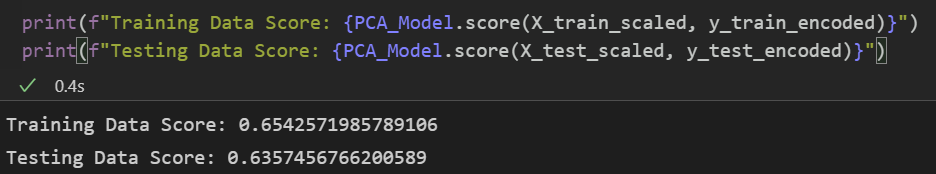
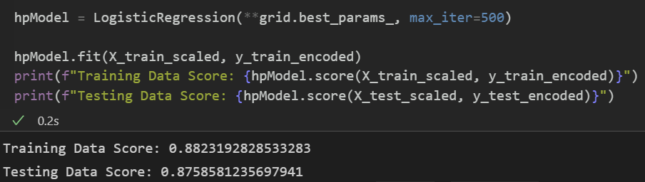

# Report
During this project I compare 3 different regression methods:
-	SVC(Support vector machine)
-	Linear Regression
-	Logistic Regression

There is close comparison between SVC and Logistic Regression. Both got around 0.87 precision for the test data (using a 7 as a random seed for the split). Something interesting is that with the train data the SVC got a better score (0.89) that Logistic Regression (0.88) with a polynomial expression with an exponent of 10. We can expect to increase the accuracy of the SVC model increasing the exponent even further, but this will only generate overfitting on the train data and no improvement on the test data or even a decrease in the accuracy.

Below you can the exact valuer for each model.

# SVC

# Linear Regression

# Logistic Regretion
